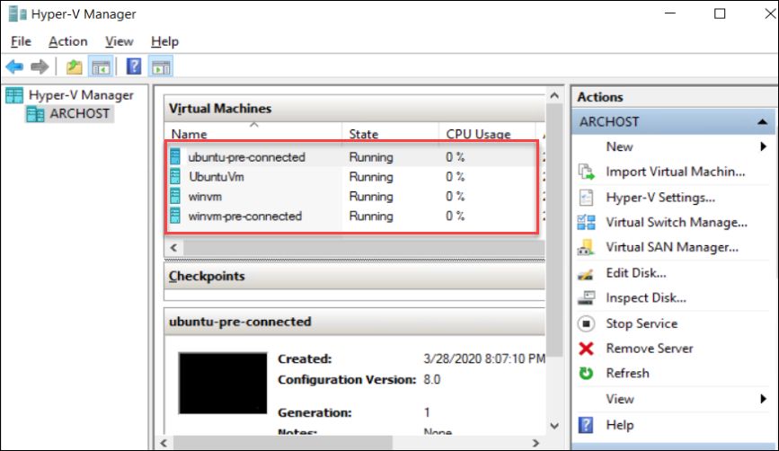
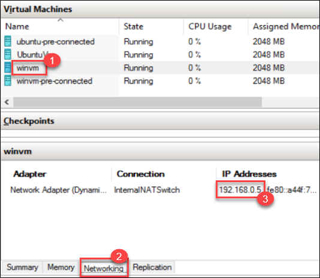

# Exercise 3: Connect On-Prem Servers to Azure with Arc

Azure Arc extends Azure Resource Manager capabilities to Linux and Windows servers, as well as Kubernetes clusters on any infrastructure across on-premises, multi-cloud, and edge. With Azure Arc, customers can also run Azure data services anywhere, realizing the benefits of cloud innovation, including always up-to-date data capabilities, deployment in seconds (rather than hours), and dynamic scalability on any infrastructure. Azure Arc for servers is currently in public preview.

## Task 1: Login and become familiar with Hyper-V Infrastructure
Hyper-V is Microsoft's hardware virtualization product. It lets you create and run a software version of a computer, called a virtual machine. Each *virtual machine* acts like a complete computer, running an operating system and programs. When you need computing resources, virtual machines give you more flexibility, help save time and money, and are a more efficient way to use hardware than just running one operating system on physical hardware.
In this task, you will walk through **on-prem** environment which is hosted on **Hyper-V**. You will find four virtual machines hosted on Hyper-V server.	
1. Find the ARCHOST VM details on lab details page:

    

2. Login to the **ARCHOST** VM using **RDP** connection.
3. Once you logged into the VM, launch the **Hyper-V manager** from the shortcut created on desktop. You’ll see total four virtual machines are running in Hyper-V. Two **Windows VM** and two **Linux (Ubuntu) VM**. **winvm-pre-connected** and **ubuntu-pre-connected** VM is already connected to **Azure Arc**, which you explored in earlier exercises on **Azure portal**.

   

4. You can check the **private IP address** of the VM by selecting the VM in Hyper-V manager and then click on **Networking**.

    

## Task 2: Connect a Windows Server Virtual Machine to Azure Arc
Azure Arc for servers (preview) allows you to manage your Windows and Linux machines hosted outside of Azure on your corporate network or other cloud provider, similarly to how you manage native Azure virtual machines. When a hybrid machine is connected to Azure, it becomes a connected machine and is treated as a resource in Azure. Each connected machine has a Resource ID, is managed as part of a resource group inside a subscription, and benefits from standard Azure constructs such as Azure Policy and applying tags.

In this task, you will connect the **windows server machine** to **Azure ARC**. There are multiple ways to do this.
 * Connect Machines to Azure Arc from Azure portal.
 * Connect Machines at scale using a service principle
 * Connect machines to Azure Arc with PowerShell DSC
  
We will use the 2nd method to connect our **windows machine** to Azure.
1. Launch **Windows PowerShell** from desktop shortcut.
2. Run the following commands, it will execute the ***ConnectWindowsServertoAzureArc.ps1*** script. Enter **WinVm** private IP when it will prompt for IP Address of ***windows server machine***. You can get it with same approach shown in task 1. 
   ```
    cd C:\LabFiles\
    $ip = Read-Host -Prompt 'IP Address of Windows Server machine'
    .\ConnectWindowsServertoAzureArc.ps1 -WindowsServerIP $ip
   ```
   
   

3. **ConnectWindowsServertoAzureArc.ps1** is getting following values from ***C:\LabFiles\creds.txt*** file and storing that to **variables**. You can review the script to understand it in depth.
     * Azure service principle ID     
     * App Secret     
     * Resource group name     
     * Subscription and tenant id
     
After getting these values, it is creating **pscredential** to login in **Azure PowerShell** using service principle and then, creating a script block to run that block inside the **machines hosted on Hyper-V**. Script block will install the Arc agent package inside vm and connect with Azure Arc. Script block is getting executed remotely with Invoke command from ARCHOST vm with computer name/private ip of WinVm.

## Task 3: Connect a Linux Virtual Machine to Azure Arc
In this task, we will connect the Linux machine to Azure Arc. 
1. Open windows PowerShell and run the following command and pass the **UbuntuVm** ip in powershell console when it prompt for **IP Address of Linux machine**
     * UbuntuVm IP: **192.168.0.7**
    ```
    cd C:\LabFiles\
    $ip = Read-Host -Prompt 'IP Address of Linux machine'
    .\ArcAgentLinux.bat $ip
    ```
   

2. These commands will open a **Putty session** for **UbuntuVm** and login to the machine and run the Azure Arc connect commands automatically. Once the machine is **onboarded** to Azure Arc, you can see the following message in **Putty terminal**:
**info msg= “Successfully Onboarded Resource to Azure”**

   
