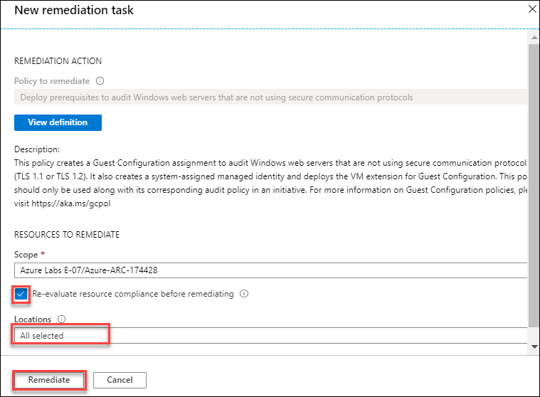

# Windows Server Management
  * Windows web servers that are not using secure communication protocols (requires IIS on nodes) 
  * Windows VMs on which the specified services are not installed and 'Running' 
  * Windows VMs that are not joined to the specified domain 
  * Windows VMs in which the Administrators group does not contain only the specified members 
  * Windows VMs with a pending reboot
  
# Additional Audit Policies
  * Add tag to all resources in a resource group using Azure policy 
  * Audit certificate going to expire in 30 days 
  * Audit on password policy on the machine 
  * Audit for an application installed on the machine (check for notepad.exe)
  
## Terms used in this exercise:
   * Intiative
   * Remediation tasks
   * Compliant
   * Non-compliant

## Windows web servers that are not using secure communication protocols (requires IIS on nodes)

In this task, we will create an initialive assignment **Audit Windows web servers that are not using secure communication protocols**, which will audit the VM as **Compliant** which doesn't have IIS enabled and audit teh VMs as **Non-compliant** in which IIS is enabled.

You will apply the **Initiatives** at resource group and it will audit all the guest VMs within that resource group.

1. In your Azure portal, browse through the **Resource groups**. From the navigate panel, select **Resource groups**.

   

1. You will see one resource group like **Azure-ARC-170523**, where 170523 is unique id and it may be different for your lab
environment. Select **Azure-ARC-170523**.

    
   
1. Now, select the **Policies** then select **Compliance** and then select **Assign initiative** to assign the in-build initiative.
   
   
   
1. Leave default value for the **Scope**, **Exclusions** and for **Basics** click on the ellipses (…) to the right of **Initiative definition**.

   
   
1. In the Search window for available definitions, type **secure** and select the one called **Audit Windows web servers that are not using secure communication protocols**. Click the **Select** button below.

   
   
1. Click **Next** at the bottom of the window and on **Parameteres** tab leave default value and move to the next tab by selecting the **Next** button.

   
    
1. On **Remediation** blade, read the description and then select the **checkbox** for **Create a remediation task**. This ensures that the policy will apply to existing resources after the initiative is assigned. If that box is not selected, then the initiative only applies to newly created resources.

1. Select the **Create a Managed Identity** check box and the click **Next** again.

   
   
1. Then at the bottom of the **Assign initiative** window click on **Create**.

   
   
1. Click on the new **initiative** just created **Audit Windows web servers that are not using secure communication protocols**.

   
   
1. Click **Create a Remediation Task** at the top right, it will start the Remediation if it is not started already, if it is already started then it can give error like one remediation task is already running, you can ignore that error and proceed.

   
   
1. Check mark the Re-evalute resource compliance before remediating, select the all locations and then click on **Remediate**.

   
   
1. In the next window at the bottom you will see a blue circle beside **Evaluating**. When it is successful and completed, the circle will turn green and it will say **Complete**. NOTE: if you had many ARC servers, you could evaluate the all at once but changing the scope to select one of more locations or all within a resource group.

   
   
1. Optional initiatives to try… repeat the steps above to test some other policies such as:

 

