## Azure Arc: Hands-on Lab

For customers who want to simplify complex and distributed environments across on-premises, edge and multi-cloud, Azure Arc enables deployment of Azure services anywhere and extends Azure management to any infrastructure.

This hands-on lab introduces readers to Azure Arc and includes walkthrough of setup and management of connected scenarios through Azure Arc.
## Table of Contents

**Azure Arc: Hands-on Lab**                                                                     1	

Exercise 1: Getting started with Azure Governance                                               2

  Task 1: Login to Azure Portal                                                                 2
  
  Task 2: Azure Activity Logs                                                                   5

  Task 3: Manage Resources Tags                                                                 6

  Task 4: Azure Policies                                                                        7

Exercise 2: Getting started with Azure Arc.....................................................	11

  Task 1: Browse through the Arc Connected machine in Azure Portal..............................11

Exercise 3: Connect On-Prem Servers to Azure with Arc..........................................	13

  Task 1: Login and become familiar with Hyper-V Infrastructure.................................13

  Task 2: Connect a Windows Server Virtual Machine to Arc.......................................15

  Task 3: Connect a Linux Virtual Machine to Arc................................................16

Exercise 4: Azure Governance for Arc Connected Machine.........................................	16

  Task 1: Apply Policy...........................................................................16	

  Task 2: Tag your ARC server....................................................................21	

  Task 3: Activity Logs..........................................................................22	

  Task 4: RBAC...................................................................................22	

## Exercise 1: Getting started with Azure Governance 

In this exercise, you will walk through some of the Azure Governance capabilities including Azure Activity Logs, Resource tags and policies. In the first exercise we’ll be trying out these capabilities with Azure resources and then extend to Azure Arc later during the lab.  
## Task 1: Login to Azure Portal
In this task, you will login to Azure using the lab credentials and browse through Azure Portal.
1.	Navigate to  Azure Portal.

	

2.	Login with Azure credentials Username and Password shown on Environment Details page. You can use copy icon to copy the values.

 	

3.	Enter the Username value in **Email**, **phone** or **Skype** field, and select the **Next**. 

	

4.	Now, enter the **Password** value, and select **Sign in**.

  	

5.	Once you select the Sign in and **Stay signed in?** popup will appear, select the **Yes** to continue.
 
	

6.	You will see Welcome to Microsoft Azure popup windows once you signed into Azure. Select **Maybe later**.
 
	
	
## Task 2: Azure Activity Logs
The Azure Activity Log provides insight into events that have occurred in Azure. In this task you will explore on Azure Activity Logs on the existing **resource group** in Azure. 
1.	In your Azure portal, browse through the resource groups. From the navigate panel, select Resource groups.

	

2.	You will see one resource group like **Azure-ARC-170523**, where 170523 is unique id and it may be different for your lab
environment. Select **Azure-ARC-170523** from resource groups.

   
 

3.	Now, select the Activity logs to check the activities of last few hours on this resource group.
 
  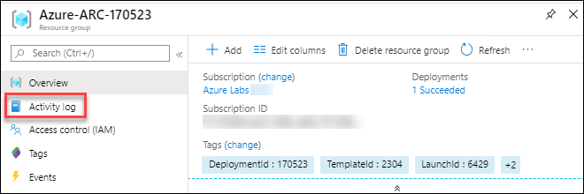

4.	Under Activity logs you can see *‘Write Azure Arc Machines’* action in **Succeeded8* state and this action is performed by ‘https://odl_user_sp_170523’. To check more details for this activity log, click on the activity log operation Name. You can go to the resource group overview and see one resource with resource type *‘Microsoft.HybridCompute’*.

 
## Task 3: Manage Resources Tags
You apply tags to your Azure resources, resource groups, and subscriptions to logically organize them into a taxonomy. Each tag consists of a name and a value pair. For example, you can apply the name "Environment" and the value "Production" to all the resources in production.
1.	Basically, tags can be applied on Subscription, resource group and resources level. Wherever you want to apply the tag just click on that resource and from left menu blade click on the **Tag**.
2.	In this task, we will apply Tag on resource group. Click on the Tag.

  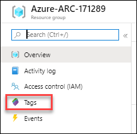
 

3.	You will several **Tags** are already there; you can create new Tag, remove existing Tag and then Save them.

  
        
        
 

## Task 4: Azure Policies
Azure Policy is a service in Azure that you use to create, assign, and manage policies. These policies enforce different rules and effects over your resources, so those resources stay compliant with your corporate standards and service level agreements. Azure Policy meets this need by evaluating your resources for non-compliance with assigned policies. All data stored by Azure Policy is encrypted at rest.
1.	Go to your resource group and click on the **Policies** under **Settings**. Click on **Compliance** and then check if there is any assignment on current scope. New policy assignments can be done through **Assign policy** and **Assign Initiative** options, Initiative can be a group of policies. Click on **Assign policy**

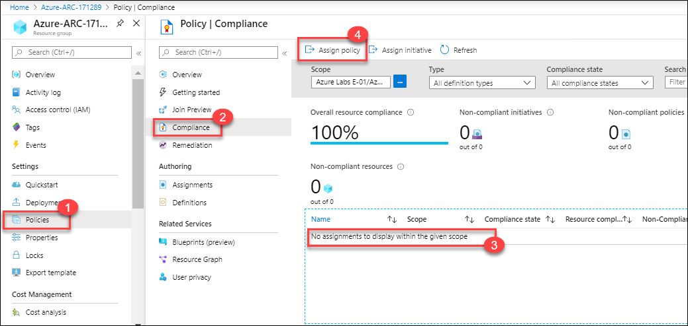

 

2.	On **Basics** tab, click on the three dot’s (ellipses) to select the existing policy definition.

 

3.	Now, in **Search box** type **“Require a tag and its value on resource groups”** and click on the searched definition and then click on **Select**.

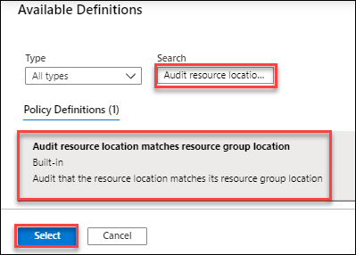
 

4.	 Now, click on next to move on parameters tab.

 

5.	Enter the following **Tag Name** and **Tag Value** in parameters and click on **Next**.
•	Tag Name: Environment
•	Tag Value: Lab

 

6.	Leave all the values **default** on **Remediation** tab and click on the **Review + create**.

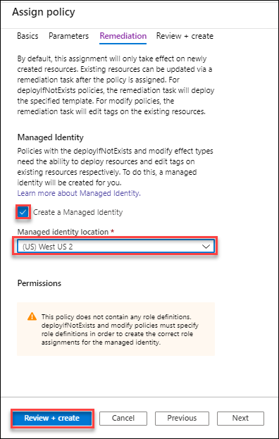
 

7.	On **Review + create** tab click on the **Create** to create the policy assignment.

 
## Exercise 2: Getting started with Azure Arc
In the provided lab environment, you would already have one Windows Server running on-prem in a Hyper-V machine connected through Arc. In this exercise, we’ll explore this pre-connected Azure Arc resources. 
## Task 1: Browse through the Arc Connected machine in Azure Portal.
In this lab, two on-prem servers one **windows**, and **Linux** are pre-connected to Azure Arc and you can access the pre-connected server and play around those. 
1.	On Azure portal, search for Azure Arc from search box and then select the Machines – Azure Arc.

 

2.	You will see, following two machines are pre-connected
•	pre-connected-ubuntu
•	pre-connected-winvm

 

3.	Click on one of the pre-connected machines.

 

4.	From here, you can **manage** and **govern** your machines with **Manage access** and **Assess compliance**. You will explore on that next exercises.

 
## Exercise 3: Connect On-Prem Servers to Azure with Arc
Azure Arc extends Azure Resource Manager capabilities to Linux and Windows servers, as well as Kubernetes clusters on any infrastructure across on-premises, multi-cloud, and edge. With Azure Arc, customers can also run Azure data services anywhere, realizing the benefits of cloud innovation, including always up-to-date data capabilities, deployment in seconds (rather than hours), and dynamic scalability on any infrastructure. Azure Arc for servers is currently in public preview.

## Task 1: Login and become familiar with Hyper-V Infrastructure
Hyper-V is Microsoft's hardware virtualization product. It lets you create and run a software version of a computer, called a virtual machine. Each *virtual machine* acts like a complete computer, running an operating system and programs. When you need computing resources, virtual machines give you more flexibility, help save time and money, and are a more efficient way to use hardware than just running one operating system on physical hardware.
In this task, you will walk through on-prem environment which is hosted on Hyper-V. You will find four virtual machines hosted on Hyper-V server.	
1.	Find the ARC-Host VM details on lab details page:

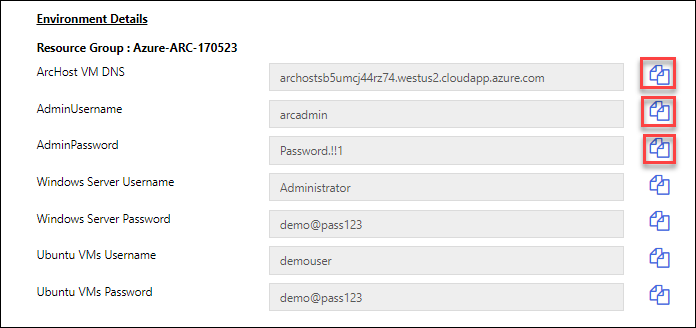
 

2.	Login to the ARC-Host VM using RDP connection.
3.	Once you logged into the VM, launch the Hyper-V manager from the shortcut created on desktop. You’ll see total four virtual machines are running in Hyper-V. Two Windows VM and two Linux (Ubuntu) VM. **winvm-pre-connected** VM is already connected to Azure Arc, which you explored in earlier exercises on Azure portal.

 

4.	You can check the private IP address of the VM by selecting the VM in Hyper-V manager and then click on Networking.

 

## Task 2: Connect a Windows Server Virtual Machine to Arc
Azure Arc for servers (preview) allows you to manage your Windows and Linux machines hosted outside of Azure on your corporate network or other cloud provider, similarly to how you manage native Azure virtual machines. When a hybrid machine is connected to Azure, it becomes a connected machine and is treated as a resource in Azure. Each connected machine has a Resource ID, is managed as part of a resource group inside a subscription, and benefits from standard Azure constructs such as Azure Policy and applying tags.
In this task, you will connect the windows server machine to Azure ARC. There are multiple ways to do this.
•	Connect Machines to Azure Arc from Azure portal.
•	Connect Machines at scale using a service principle
•	Connect machines to Azure Arc with PowerShell DSC
We will use the 2nd method to connect our windows machine to Azure.
1.	Launch Windows PowerShell from desktop shortcut.
2.	Run the following commands, it will execute the ConnectWindowsServertoAzureArc.ps1 script. Enter **WinVm** private IP when it will prompt for IP Address of **‘windows server machine’**. You can get it with same approach shown in task 1. 

cd C:\LabFiles\
$ip = Read-Host -Prompt 'IP Address of Windows Server machine'
.\ConnectWindowsServertoAzureArc.ps1 -WindowsServerIP $ip

 
3.	ConnectWindowsServertoAzureArc.ps1 is getting following values from C:\LabFiles\creds.txt file and storing that to variables. You can review the script to understand it in depth.
•	Azure service principle ID
•	App Secret
•	Resource group name
•	Subscription and tenant id
After getting these values, it is creating pscredential to login in Azure PowerShell using service principle and then, creating a script block to run that block inside the Hyper-V machine. Script block will install the Arc agent package inside vm and connect with Azure Arc. Script block is getting executed remotely with Invoke command from ARC-Host vm with computer name/private ip of WinVm.
## Task 3: Connect a Linux Virtual Machine to Arc
In this task, we will connect the Linux machine to Azure Arc. 
1.	Open windows PowerShell and run the following command and pass the Linux vm ip in prompt
cd C:\LabFiles\
$ip = Read-Host -Prompt 'IP Address of Linux machine'
.\ArcAgentLinux.bat $ip

 

2.	These commands will open a putty session and login to the Linux machine and run the Azure Arc connect commands automatically. Once the machine is onboarded to Azure you can see the following message in putty terminal:
info msg= “Successfully Onboarded Resource to Azure”

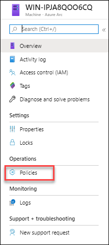
 

## Exercise 4: Azure Governance for Arc Connected Machine
**Task 1: Apply Policy**
1.	From the **Machine -Azure Arc** menu for the Hybrid Server you are working with, click on **Policies**

 
2.	Click **Assign Initiative**

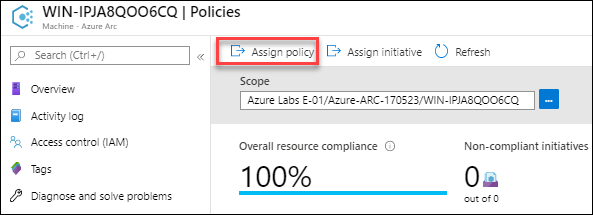
 
3.	To the right of **Basics** click on the ellipses (…) to the right of **Initiative definition**

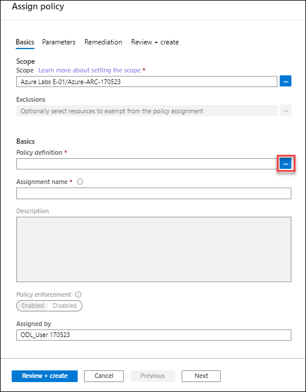
 
4.	In the **Search** window for available definitions, type “Time ” and select the one called **Show Audit results from Windows VMs that are not set to the specified time zone**.  Click the blue **Select** button below

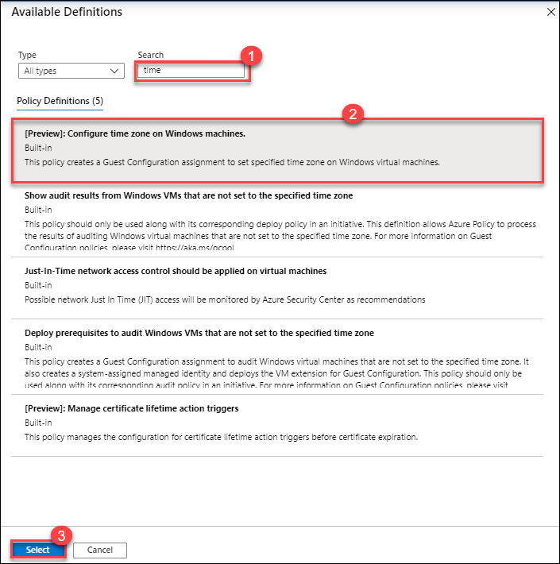
 
5.	Click **Next** at the bottom of the window.

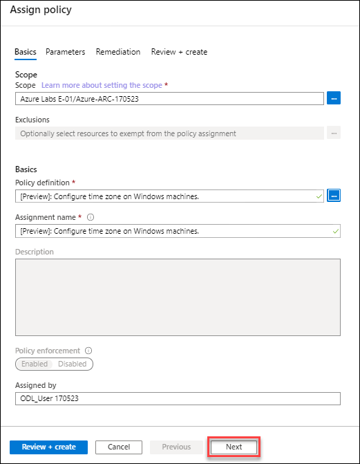
 
6.	From the **Time zone** drop down menu select **“(UTC) Coordinated Universal Time”**. Click **Next**
7.	Read the description and then select the checkbox for **Create a remediation task**. This ensures that the policy will apply to existing resources after the policy is assigned.  If that box is not selected, then the policy only applies to newly created resources.
8.	Select the **Create a Managed Identity** check box and the click **Next** again

 
9.	Then at the bottom of the **Assign Policy** window click on **Create**.

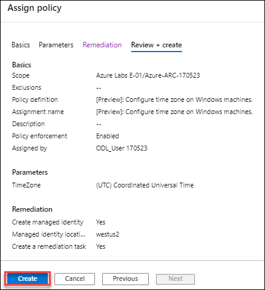
 
10.	Click on the new initiative just created **Audit Windows VMs that are not set to the specified time zone**
11.	Click **Create a Remediation Task** at the top right.

 

12.	Confirm that the **Scope** is showing the correct Resource Group – should default to …/ARC

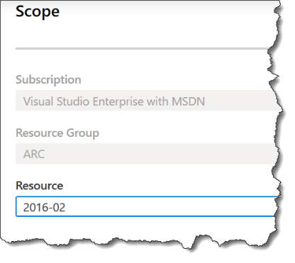
o	Click on the **ellipses** …to the right to select all options to include the server as shown to the right

13.	Select the Checkbox beneath **Re-evaulate resource compliance before remediating**
14.	In the Locations drop-down list, select the location where you installed your ARC Server
o	If you are not sure or can’t remember, look on the **Overview** window for your server
15.	Click **Remediate** at the bottom of the **New Remediation Task** window
In the next window at the bottom you will see a blue circle beside **Evaluating**. When it is successful and completed, the circle will turn green and it will say **Complete**. NOTE: if you had many ARC servers, you could evaluate the all at once but changing the scope to select one of more locations or all within a subscription.
Optional initiatives to try… repeat the steps above to test some other policies such as:
**Operational compliance**
•	Micro-segmentation to ensure servers are connected to the right network (remote host connection status doesn't match the specified one)
•	Certificate about to expire
•	Application installed: ensure backup is installed
•	Machines are not restarted after 45 days, indicator that it has been forgotten, running but not used
**Security compliance**
•	Password policy
•	Application installed or not installed (like diagnostic tools used for investigation, but make sure it is removed after troubleshooting)
•	TLS 1.2 monitoring => part of PCI DSS (data security standard)

## Task 2: Tag your ARC server
1.	Open the Azure portal page. Click on this link to go to the Azure ARC machine(s) you have built
2.	Click on your machine that you want to tag

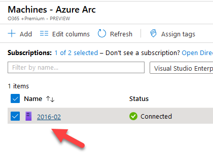

 
3.	After clicking on it, Click on **Tags** in the center blade
4.	Create the following tags and then Save them
Name	Value
ARCServerType	Windows
CostCenter	IT
Department	Central IT
Owner 	<your name>
5.	After saving them they should look like this…
	
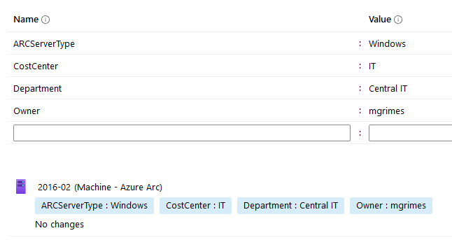

	

## Task 3: Activity Logs
## Task 4: RBAC
